# @6d-ui/buttons
Contains different type buttons 

<!-- START doctoc generated TOC please keep comment here to allow auto update -->
<!-- DON'T EDIT THIS SECTION, INSTEAD RE-RUN doctoc TO UPDATE -->
**Table of Contents**  *generated with [DocToc](https://github.com/thlorenz/doctoc)*

- [Installation](#installation)
- [Usage](#usage)
- [Output](#output)
- [Configuration](#configuration)
  - [Basic Configuration](#basic-configuration)
    - [style](#style)
    - [type](#type)
    - [size](#size)
    - [width](#width)
    - [align](#align)
    - [label](#label)
    - [color](#color)

<!-- END doctoc generated TOC please keep comment here to allow auto update -->
      
## Installation  
  	$ git clone http://10.0.0.15/6d-UI/buttons.git
    $ cd [your project dir]
	$ npm link [path of buttons]
   
## Usage
  ```js
  	import React, { Component } from 'react';
	import './App.css';
	import {
      CustomButton,
      BUTTON_STYLE,
      BUTTON_TYPE,
      BUTTON_SIZE,
      BUTTON_ALIGN,
      COLOR
    } from '@6d-ui/buttons'

    class App extends Component {
      render() {
        return (
          <div className="App">
            <div className="form-buttons">
              <CustomButton
                style={BUTTON_STYLE.BRICK}
                type={BUTTON_TYPE.PRIMARY}
                size={BUTTON_SIZE.MEDIUM_LARGE}
                align="right"
                label="Create"
                isButtonGroup={true}
              />
              <CustomButton
                style={BUTTON_STYLE.BRICK}
                type={BUTTON_TYPE.SECONDARY}
                size={BUTTON_SIZE.MEDIUM_LARGE}
                color={COLOR.PRIMARY}
                align="right"
                label="Cancel"
                isButtonGroup={true}
              />
            </div>
          </div>
        );
      }
    }
	export default App;
```

## Output

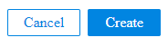

## Configuration
### Basic Configuration

| Property        | Type    | Default Value |Description
|:---------------:|:-------:|:-------------:|-------------|
|style            |`Integer` |btn			|style of button like button for create or alert box
|type			  |`Integer`	|undefined		|type of button depending on use like normal button or button for an alert box
|size 			  |`Integer` |undefined    	|sets the size of the button like small , medium , large etc
|width			  |`Integer` |undefined 		|sets the width of the button like inherit
|align			  |`String`	|undefined		|aligns of button towards left or right or center etc
|label			  |`String` |undefined 		|name of button like create , cancel etc
|isButtonGroup	  |`Boolean`|undefined      | `boolean` that decides whether it is a group of buttons or not
|color			  |`String` |undefined      |font color

#### style
If  `style` is `BUTTON_STYLE.BRICK` then the output will be 

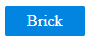

If `style` is `BUTTON_STYLE.ROUNDED` then the output will be

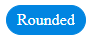

#### type
If `type` is `BUTTON_TYPE.PRIMARY` output will be

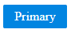

If `type` is `BUTTON_TYPE.SECONDARY` output will be

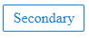

If `type` is `BUTTON_TYPE.ALERT_PRIMARY` output will be

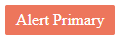

If `type` is `BUTTON_TYPE.ALERT_SECONDARY` output will be

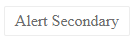

#### size
If `size` is `BUTTON_SIZE.SMALL` the output will be 

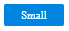

If `size` is `BUTTON_SIZE.MEDIUM` the output will be 

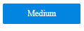

If `size` is `BUTTON_SIZE.LARGE` the output will be 

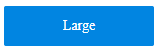

If `size` is `BUTTON_SIZE.MEDIUM_LARGE` the output will be 

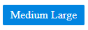

#### width
If the `width` is `BUTTON_ALIGN.INHERIT` then the output will be

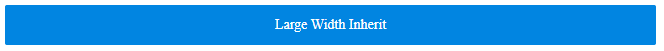

The button will take the complete width of the parent element

#### align
We can `align` the button to left or right or center etc accordingly. 
 
#### label
Any `label` can be given to the button according to the need.

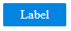

```js
<CustomButton
            style={BUTTON_STYLE.BRICK}
            type={BUTTON_TYPE.PRIMARY}
            size={BUTTON_SIZE.MEDIUM_LARGE}
            align="right"
            label="Label"
            isButtonGroup={true}
          />
  ```        

#### color
If `color` is `COLOR.PRIMARY` output will be 


```js
<CustomButton
            style={BUTTON_STYLE.BRICK}
            type={BUTTON_TYPE.PRIMARY}
            size={BUTTON_SIZE.MEDIUM_LARGE}
            align="right"
            label="Primary"
            isButtonGroup={true}
          />
 ```         
If `color` is `COLOR.SECONDARY` output will be

 
 
 ```js
 <CustomButton
            style={BUTTON_STYLE.BRICK}
            type={BUTTON_TYPE.ALERT_SECONDARY}
            size={BUTTON_SIZE.MEDIUM_LARGE}
            color={COLOR.SECONDARY}
            align="right"
            label="Alert Secondary"
            isButtonGroup={true}
          />
 ```