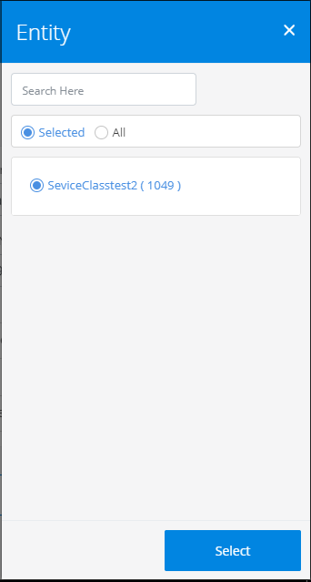
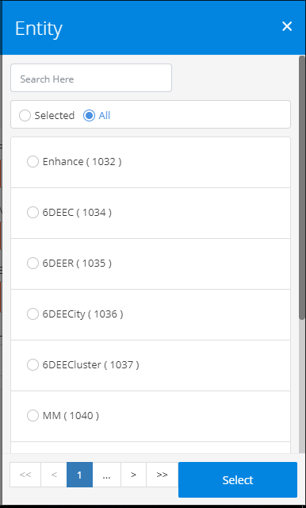
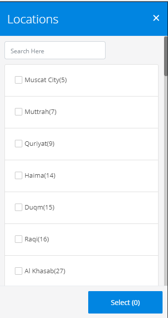
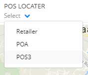
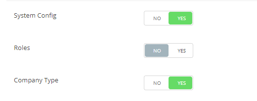
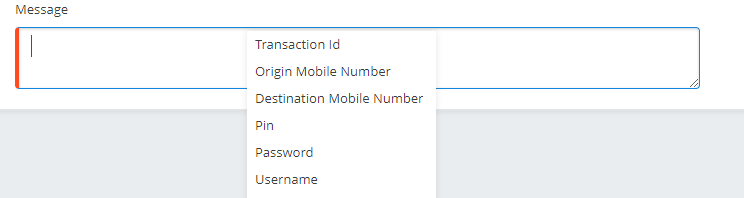
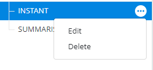
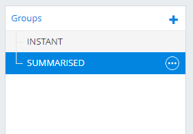

# @6d-ui/form
Contains `@6d-ui/form`

<!-- START doctoc generated TOC please keep comment here to allow auto update -->
<!-- DON'T EDIT THIS SECTION, INSTEAD RE-RUN doctoc TO UPDATE -->
**Table of Contents**  *generated with [DocToc](https://github.com/thlorenz/doctoc)*

- [Installation](#installation)
- [ComplexSelectorModal](#complexselectormodal)
  - [Usage](#usage)
  - [Output](#output)
    - [Selected Items](#selected-items)
    - [List Items](#list-items)
  - [Configuration](#configuration)
- [SelectorModal](#selectormodal)
  - [Usage](#usage-1)
  - [Output](#output-1)
  - [Configuration](#configuration-1)
- [StyledDropDown](#styleddropdown)
  - [Usage](#usage-2)
  - [Output](#output-2)
  - [Configuration](#configuration-2)
- [TreeMenu](#treemenu)
  - [Usage](#usage-3)
  - [Configuration](#configuration-3)
- [DragDropTarget](#dragdroptarget)
  - [Usage](#usage-4)
  - [Configuration](#configuration-4)
- [Switch](#switch)
  - [Usage](#usage-5)
  - [Output](#output-3)
  - [Configuration](#configuration-5)
- [CustomContextMenu](#customcontextmenu)
  - [Usage](#usage-6)
  - [Output](#output-4)
  - [Configuration](#configuration-6)
- [IconDropDownMenu](#icondropdownmenu)
  - [Usage](#usage-7)
  - [Output](#output-5)
  - [Configuration](#configuration-7)
- [ListData](#listdata)
  - [Usage](#usage-8)
  - [Output](#output-6)
  - [Configuration](#configuration-8)

<!-- END doctoc generated TOC please keep comment here to allow auto update -->
## Installation  
  	$ git clone http://10.0.0.15/6d-UI/form.git
    $ cd [your project dir]
    $ npm link [path of form]

## ComplexSelectorModal
It is a complex dropdown `Component` having search option inside the dropdown. To populate data we call a `url`.
It have pagination with each page containig a definite set of data.

### Usage
```js
 <ComplexSelectorModal 
    url={ this.props.url_ChannelPartners_SearchUrl }
    ajaxUtil={ this.props.ajaxUtil }
    authKey={this.props.ajaxUtil.getAuthKey()}
    parseResponse={this.parseResponse}
    buildRequest={this.buildRequest.bind(this)}
    onCancel={() => this.toggleAction(0)}
    onSubmitClick={this.submitModal.bind(this, "Entity")}
    title={ this.state.modalTitle }
    isRadioButton= { this.state.isEntity ? true : false }
    selectedItems={this.state.entity}
    listItems = {this.state.entity}
/>
```
### Output
#### Selected Items 



#### List Items



### Configuration
| Property        | Type      | Default Value |Description
|:---------------:|:---------:|:-------------:|----------------------------| 
|url |`String` | undefined | url to fetch the data to be populated in the `ComplexSelectorModal`
|ajaxUtil |`Object` | undefined |passes an `Object` of `ajaxUtil`
|parseResponse |`Function` | undefined | passes a `Function` to process the response and the result data is populated inside the `ComplexSelectorModal`
|buildRequest | `Function` | undefined | passes a function to make the request contaning the parameters to be passed with `url` to get data 
|onCancel |`Function` | undefined | passes the `Function` 
|onSubmitClick |`Function` | undefined | passes the `Function`
|title | `String` |undefined | `title`  given to the `SelectorModal` 
|listItems| `ArrayList` | undefined | contains `ArrayList` of the selected items. 
|selectedItems|`ArrayList`|undefined | contains `ArrayList` of the selected items & the list changes by changing the selected items from the list 
|isRadioButton |`Boolean` | undefined | indicates if it needs a radio button or not

## SelectorModal
It is a simple dropdown `Component` , having serach in the dropdown. 

### Usage
```js
<SelectorModal 
  { ...this.state }
  ajaxUtil={this.props.ajaxUtil}
  onCancel = { () => this.toggleAction(0) }
  onSubmitClick = { this.submitModal.bind(this, "Locations") }
  title = { this.state.modalTitle }
  listItems = { this.state.modalList }
  selectedItems = { this.state.modalSelected } 
  isRadioButton= { this.state.salesPersonCheck ? this.state.salesPersonCheck.fieldAgent ? true : false : false }
/>
```
### Output



### Configuration
| Property        | Type      | Default Value |Description
|:---------------:|:---------:|:-------------:|----------------------------| 
|ajaxUtil |`Object` | undefined |passes an `Object` of `ajaxUtil`
|onCancel |`Function` | undefined | passes the `Function` 
|onSubmitClick |`Function` | undefined | passes the `Function`
|title | `String` |undefined | `title`  given to the `SelectorModal` 
|listItems| `ArrayList` | undefined | contains `ArrayList` of the selected items. 
|selectedItems|`ArrayList`|undefined | contains `ArrayList` of the selected items & the list changes by changing the selected items from the list 
|isRadioButton |`Boolean` | undefined | indicates if it needs a radio button or not

## StyledDropDown

### Usage
```js
 <StyledDropDown
  value={this.state.locatorEntityTypeId}
  onSelect={this.onLocatorEntitySelect.bind(this)}
  options={this.getPosLocatorSelectValues(this.state.childEntites)}
/>
```
### Output



### Configuration
| Property        | Type      | Default Value |Description
|:---------------:|:---------:|:-------------:|----------------------------| 
|value|`String`|undefined|
|onSelect | `Function`| undefined |passes the selected value as argument 
|options |`List` |undefined|the options to be shown in the `dropdown` as value- label pair

## TreeMenu
This component displays list of tree-structured data in the form of Menu Tree.
### Usage
```js
  <TreeMenu 
    listItems={listItems} 
    isDraggableContent={true} 
    targetKey="data"
  />
```

### Configuration
| Property        | Type      | Default Value |Description
|:---------------:|:---------:|:-------------:|----------------------------| 
|listItems|`list`|undefined| list of hierarchy tree json data
|isDraggableContent | `boolean`| true | if 'true', the last child of hierarchy tree will be draggable  
|targetKey |`String` |`dragKey`| Use property targetKey to identify compatible drag elements and targets.

## DragDropTarget
This component is where we drop a draggable component.
### Usage
```js
  <DragDropTarget
    dropped={this.handleDrop}
    targetKey={targetKey}
    onDragEnter={this.handleDragEnter}
    onDragLeave={this.handleDragLeave}
  >
  </DragDropTarget>
```

### Configuration
| Property        | Type      | Default Value |Description
|:---------------:|:---------:|:-------------:|----------------------------| 
|dropped|`function`|undefined| dropped is when a compatible container is dropped on the target
|targetKey |`String` |`dragKey`| Use property targetKey to identify compatible drag elements and targets.
|onDragEnter |`function` |undefined| Callbacks that fire when a compatible DragDropContainer passes over.
|onDragLeave |`function` |undefined| Callbacks that fire when a compatible DragDropContainer passes over.

## Switch

### Usage
```js
<Switch
  handleChange={this.props.handleMultiLocationSelect}
  disabled={field.isMandatory}
  checked={this.props.hasMultiLocation}
/>
```
### Output



### Configuration
| Property        | Type      | Default Value |Description
|:---------------:|:---------:|:-------------:|----------------------------| 
|handleChange|`Function`|undefined|pass the `Function`
|disabled | `Boolean`| false |whether the component is `disabled` or not
|checked |`Boolean` |false|whether the component is `checked` or not

## CustomContextMenu

### Usage
```js
<CustomContextMenu
    id={"idContxtSMS"}
    options={this.props.contextMenuOpts}
    onChange={this.handleChangeOption.bind(this)}
    className={"col-8 p-0"}
>
  <textarea>
    text area where you can right-click to view `CustomContextMenu`
  </textarea>
</CustomContextMenu>
```
### Output



### Configuration
| Property        | Type      | Default Value |Description
|:---------------:|:---------:|:-------------:|----------------------------| 
|id|`String`|`idContxtSMS`|id specific to this context menu
|options | `Array`| undefined |the context menu array having label and value
|onChange |`Function` |false| function triggered on onChange
|className |`Style` |undefined|pass the style required for this particular context menu

## IconDropDownMenu

### Usage
```js
<IconDropDownMenu
    menus={[
    { label: 'Edit', handleClick: () => this.onEdit() },
    { label: 'Delete', handleClick: () => this.onDelete() }
    ]}
    color="secondary"
/>
```
### Output



### Configuration
| Property        | Type      | Default Value |Description
|:---------------:|:---------:|:-------------:|----------------------------| 
|menus|`Array`|undefined|array of menu list with label and handleClick specified
|color | `String`| undefined |color for the IconDropDownMenu

## ListData

### Usage
```js
<ListData
    title="Groups"
    values = {this.state.groupData}
    hasCreate={true}
    selectedItem = {this.state.selectedGroupId}
    triggerFunc = {this.triggerFunc.bind(this, 'group')}
    dropDwnMenuList={dropDwnMenuList}
/>
```
### Output



### Configuration
| Property        | Type      | Default Value |Description
|:---------------:|:---------:|:-------------:|----------------------------| 
|title|`String`|undefined|name of the component
|values | `Array`| undefined |array of json data
|hasCreate|`Boolean`|`true`|whether `+` button is required or not
|selectedItem | `Array`| undefined |the current selected list data
|triggerFunc|`Function`|undefined|the function called when a particular list data is clicked
|dropDwnMenuList | `Array`| undefined |array of required IconDropDownMenu
