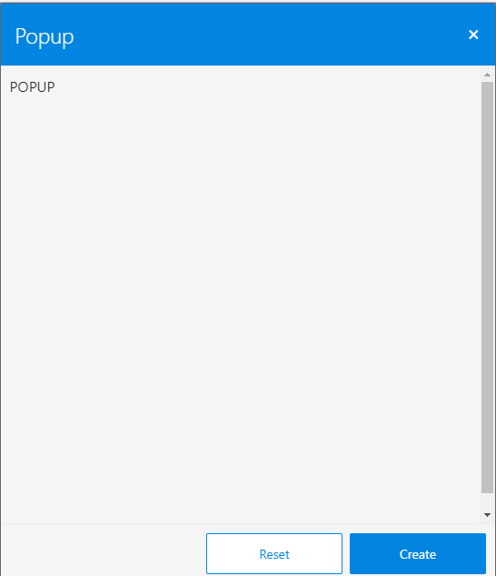
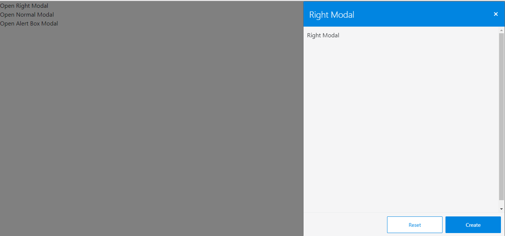
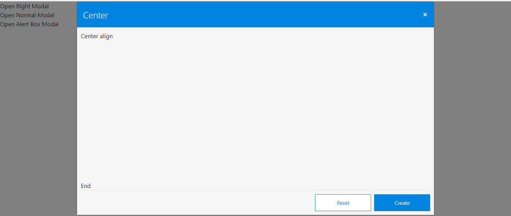
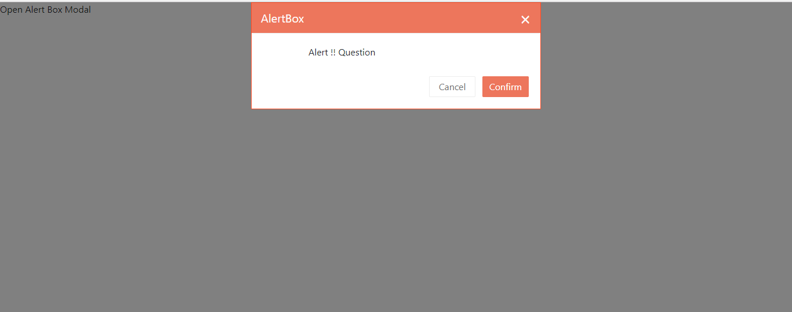

# @6d-ui/popup
Contains different type popups

<!-- START doctoc generated TOC please keep comment here to allow auto update -->
<!-- DON'T EDIT THIS SECTION, INSTEAD RE-RUN doctoc TO UPDATE -->
**Table of Contents**  *generated with [DocToc](https://github.com/thlorenz/doctoc)*

- [Installation](#installation)
- [popup](#popup)
  - [Usage](#usage)
  - [Output](#output)
  - [Configuration](#configuration)
    - [Basic Configuration](#basic-configuration)
    - [type](#type)
    - [title](#title)
    - [isOpen](#isopen)
    - [close](#close)
    - [component](#component)
- [BasicAlert](#basicalert)
  - [Usage](#usage-1)
  - [Output](#output-1)
  - [Configuration](#configuration-1)
    - [Basic Configuration](#basic-configuration-1)
    - [title](#title-1)
    - [isOpen](#isopen-1)
    - [close](#close-1)
    - [content](#content)
    - [CancelBtnLabel](#cancelbtnlabel)
    - [confirmBtnLabel](#confirmbtnlabel)
    - [rowId](#rowid)
    - [onConfirmCallBack](#onconfirmcallback)
- [PopupWithHeader](#popupwithheader)
  - [Usage](#usage-2)
  - [Configuration](#configuration-2)
    - [Basic Configuration](#basic-configuration-2)
- [POPUP_ALIGN](#popup_align)

<!-- END doctoc generated TOC please keep comment here to allow auto update -->
## Installation  
  	$ git clone http://10.0.0.15/6d-UI/popup.git
    $ cd [your project dir]
	$ npm link [path of popup]

## popup
Contains different types of `popup`.

### Usage
  ```js
  import React, { Component } from 'react';
  import './App.css';
  import Create from './components/Create';
  import Search from './components/Search';
  import {Popup, POPUP_ALIGN} from '@6d-ui/popup';
  import {
  ModalBody,
  ModalFooter
  } from 'reactstrap';

    class App extends Component {
      constructor(props) {
        super(props);
        this.toggleAction = this.toggleAction.bind(this);
        this.state = {
          modal: 0
        }
      }
      toggleAction(type) {
        this.setState({modal : type})
      }
    	onConfirmCallBack(rowId) {
        console.log(rowId);
      }
      render() {
        return (
          <div className="App">
            <div onClick={()=>this.setState({modal : 2})}>Open Right Modal</div>
         	  <Popup
                type={POPUP_ALIGN.RIGHT}
                title="Popup"
                isOpen={this.state.modal === 2}
                close={this.toggleAction}
                component={
                  <Create/>
          		}
        	/>
       	 </div>
      	);
      }
  	}

  	export default App;

```

### Output



### Configuration

#### Basic Configuration

| Property        | Type    | Default Value |Description
|:---------------:|:-------:|:-------------:|-------------|
|type             |`Integer` |undefined		|defines the type of the `popup` like centre aligned , alert etc
|title			  |`String`	|undefined		|title to be given to the `popup`
|isOpen 	      |`Boolean`|undefined    	|determines wheather the `modal` is open or not
|close			  |`Function`|undefined 	|close the `modal` bt changing state of modal
|component		  |`react component`|undefined|`component` to render inside `popup`    


#### type
If `type` is `POPUP_ALIGN.RIGHT` output will be



```js
	  <Popup
          type={POPUP_ALIGN.RIGHT}
          title="Right Modal"
          isOpen={this.state.modal === 2}
          close={this.toggleAction}
          component={
            <Create
            />
          }
        />
 ```

If `type` is `POPUP_ALIGN.CENTER` output will be



```js 
	<Popup
      type={POPUP_ALIGN.CENTER}
      title="Center"
      isOpen={this.state.modal === 1}
      close={this.toggleAction}
      component={
   		 <Search/>
    	}
 	/>
  ```
#### title
Any `title` can be given to `popup`  according to its use
#### isOpen
A boolean value  given to `isOpen` determines if the modal is open or not
#### close
Calls the method to change state of the modal and closes the `modal`.
#### component
Indicates the `component` to be rendered inside `popup`.

## BasicAlert
Contains `BasicAlert`.

### Usage
```js
  import React, { Component } from 'react';
  import './App.css';
  import {BasicAlert} from '@6d-ui/popup';
  import {
  ModalBody,
  ModalFooter
  } from 'reactstrap';

    class App extends Component {
      constructor(props) {
        super(props);
        this.toggleAction = this.toggleAction.bind(this);
        this.state = {
          modal: 0
        }
      }
      toggleAction(type) {
        this.setState({modal : type})
      }
    	onConfirmCallBack(rowId) {
        console.log(rowId);
      }
      render() {
        return (
          <div className="App">
            <div onClick={()=>this.setState({modal : 3})}>Open Alert Box Modal</div>
             <BasicAlert
              isOpen={this.state.modal === 3}
              title="AlertBox"
              content="Alert !! Question"
              CancelBtnLabel="Cancel"
              confirmBtnLabel="Confirm"
              rowId="1"
              close={this.toggleAction}
              onConfirmCallBack={this.onConfirmCallBack.bind(this)}
            />
       	 </div>
      	);
      }
  	}

  	export default App;
```
### Output



### Configuration

#### Basic Configuration

| Property        | Type    | Default Value |Description
|:---------------:|:-------:|:-------------:|-------------|
|title			  |`String`	|undefined		|title to be given to the `alertBox`
|isOpen 	      |`Boolean`|undefined    	|determines wheather the `modal` is open or not
|close			  |`Function`|undefined 	|close the `modal` bt changing state of modal
|content		  |`String`	|undefined		|`content` of `alertBox`    
|CancelBtnLabel	  |`String` |undefined 		|Label for cancel button
|confirmBtnLabel  |`String` |undefined      |Label for confirm button
|rowId			  |`String` |undefined      |Id of the row to be altered(unique id corresponding to the data)
|onConfirmCallBack|`Function`	|undefined		|function to be called after altering data 	

#### title
Any `title` can be given to `alertbox`  according to its use
#### isOpen
A boolean value  given to `isOpen` determines if the modal is open or not
#### close
Calls the method to change state of the modal and closes the `modal`.
#### content
`content` indicates the message to be given inside the `alertbox`. 
#### CancelBtnLabel
Any label an be given to `CancelBtnLabel` , by clicking which the user denys the process alerted.
#### confirmBtnLabel
Any label can be given to `confirmBtnLabel` ,by clicking which the user accepts the process alerted.
#### rowId
`rowId` is the unique id of data (Id of row) which is to be deleted/altered. 
#### onConfirmCallBack
`onConfirmCallBack` the funtion to be called after altering the data alerted.

## PopupWithHeader
It is same as `Popup` , the only difference is instead of  `String` we pass a `Component` in the `title`.

### Usage
  ```js
  import React, { Component } from 'react';
  import './App.css';
  import Create from './components/Create';
  import Search from './components/Search';
  import {Popup, POPUP_ALIGN} from '@6d-ui/popup';
  import {
  ModalBody,
  ModalFooter
  } from 'reactstrap';

    class App extends Component {
      constructor(props) {
        super(props);
        this.toggleAction = this.toggleAction.bind(this);
        this.state = {
          modal: 0
        }
      }
      toggleAction(type) {
        this.setState({modal : type})
      }
    	onConfirmCallBack(rowId) {
        console.log(rowId);
      }
      render() {
        return (
          <div className="App">
            <div onClick={()=>this.setState({modal : 2})}>Open Right Modal</div>
         	 <PopupWithHeader
                type={POPUP_ALIGN.CENTER}
                title={<Header />}
                className="commision-rule-popup"
                isOpen={this.state.modal === 2}
                close={this.toggleAction}
                component={
                  <Create/>
          		}
        	/>
       	 </div>
      	);
      }
  	}

  	export default App;

```

### Configuration

#### Basic Configuration

| Property        | Type    | Default Value |Description
|:---------------:|:-------:|:-------------:|-------------|
|type             |`Integer` |undefined		|defines the type of the `popup` like centre aligned , alert etc
|title			  |`Component`	|undefined		|the component that is to be given as the header of the popup
|isOpen 	      |`Boolean`|undefined    	|determines wheather the `modal` is open or not
|close			  |`Function`|undefined 	|close the `modal` bt changing state of modal
|component		  |`react component`|undefined|`component` to render inside `popup` 


## POPUP_ALIGN
It determines the position of the PopUp.
There is 2 cases `RIGHT` and `CENTER`.

If `POPUP_ALIGN` is `CENTER` then the output will be 


If `POPUP_ALIGN` is `RIGHT` then the output will be 


