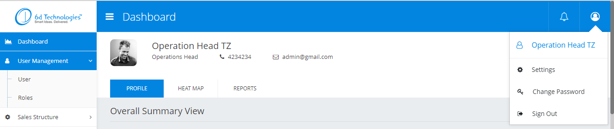

# @6d-ui/ui-components
Contains `@6d-ui/ui-components`

<!-- START doctoc generated TOC please keep comment here to allow auto update -->
<!-- DON'T EDIT THIS SECTION, INSTEAD RE-RUN doctoc TO UPDATE -->
**Table of Contents**  *generated with [DocToc](https://github.com/thlorenz/doctoc)*

- [Installation](#installation)
- [Usage](#usage)
- [Output](#output)
- [Components](#components)
  - [Header](#header)
    - [Configuration](#configuration)
  - [SideMenu](#sidemenu)
    - [Configuration](#configuration-1)
  - [Notification](#notification)
    - [Configuration](#configuration-2)
  - [Alert](#alert)
    - [Configuration](#configuration-3)
  - [ActionLoader](#actionloader)
  - [Loader](#loader)

<!-- END doctoc generated TOC please keep comment here to allow auto update -->
        
      
## Installation  
  	$ git clone http://10.0.0.15/6d-UI/ui-components.git
    $ cd [your project dir]
	  $ npm link [path of ui-components]

## Usage
```js
import React, { Component } from "react";
import { Container, Breadcrumb, BreadcrumbItem, Row, Col } from "reactstrap";
import { withRouter } from 'react-router';
import { 
  SideMenu, 
  Header, 
  } from '@6d-ui/ui-components';

class Home extends Component {
  constructor(props) {
    super(props);
    this.route = this.route.bind(this);
    this.state = {
      isSideNavShown: true,
      isLoggedIn: false,
      MENU_DETAILS: [
        {
          id: 1,
          label: "Dashboard",
          linkTo: "/home",
          icon: "fa fa-area-chart",
          privilages: [12]
        },
        {
          id: 11,
          label: "User Management",
          icon: "fa fa-user",
          submenus: [
            {
              id: 7,
              label: "User",
              linkTo: "/User",
              icon: "fa fa-users",
              privilages: []
            },
            {
              id: 22,
              label: "Roles",
              linkTo: "/Roles",
              icon: "fa fa-users",
              privilages: []
            },
          ]
        },
        {
          id: 10,
          label: "Sales Structure",
          icon: "fa fa-cog",
          submenus: [
            {
              id: 4,
              label: "Territory",
              linkTo: "/salesTerritory",
              icon: "fa fa-save",
              privilages: []
            },
            {
              id: 5,
              label: "Sales Hierarchy",
              linkTo: "/organisation",
              icon: "fa fa-save",
              privilages: []
            },
          ]
        }
      ],
      HEADER_BUTTONS: [
        {
          id: 2,
          type: 1,
          icon: 'fa-bell-o'
        },
        {
          id: 3,
          type: 2,
          icon: 'fa-user-circle-o',
          subIcon: 'fa-user-o',
          subHeader: 'User Name',
          subItems: [
            {
              id: 31,
              name: 'Settings',
              icon: 'fa-cog'
            },
            {
              id: 32,
              name: 'Change Password',
              icon: 'fa-key'
            },
            {
              id: 33,
              name: 'Sign Out',
              icon: 'fa-sign-out'
            }
          ]
        },
        {
          id: 1,
          type: 2,
          icon: 'fa-user-circle-o',
          subIcon: 'fa-user-o',
          subHeader: 'User Name',
          subItems: [
            {
              id: 11,
              name: 'Settings',
              icon: 'fa-cog'
            },
            {
              id: 12,
              name: 'Change Password',
              icon: 'fa-key'
            },
            {
              id: 13,
              name: 'Sign Out',
              icon: 'fa-sign-out'
            }
          ]
        }
      ]
    };
    this.toggleSideNav = this.toggleSideNav.bind(this);
  }
  toggleSideNav() {
    this.setState({ isSideNavShown: !this.state.isSideNavShown });
  }
  route(id, link) {
    console.log(id, link);
    if (this.props.location.pathname !== link)
      this.props.history.push(link);
  }
  onHeaderItemClick(menuId, SubMenuId) {
    console.log(menuId, SubMenuId);
  }
  toggleAction(type) {

  }
  onSubmitClick(name, value) {
    console.log(name, value);
  }
  parseResponse(response) {
    if (response)
      return { data: response.data, totalRecords: response.totalRecords }
    else
      return { data: null, totalRecords: 0 }

  }
  buildRequest(request) {
    if (!request)
      return;

    const api_request = {
      pageNumber: request.pageNumber || "",
      rowCount: request.ROW_COUNT,
      orderByCol: "id",
      sort: "asc",
      totalRecords: request.totalRecords || "",
      keyword: request.keyword
    }
    const reqFilters = [{
      name: "channelType",
      value: "1"
    }]
    api_request.filters = reqFilters;
    return api_request;
  }

  render() {
    const getBreadCrumb = () => {
      if (this.props.breadcrumb && this.props.breadCrumb.length > 0) {
        return (
          <Container className="main_breadCrumb_container">
            <Row>
              <Col>
                <Breadcrumb
                  className="main_breadCrumb">
                  <BreadcrumbItem>
                    <i className="fa fa-home" />
                  </BreadcrumbItem>
                  <BreadcrumbItem active>Dash Board</BreadcrumbItem>
                </Breadcrumb>
              </Col>
            </Row>
          </Container>
        );
      }
    };
    const sideNavStyle = {
      marginLeft: this.state.isSideNavShown ? 0 : '-215px'
    };
    return (
      <div>
        <div className="home-main-div">
          <div className="side-nav-menu" style={sideNavStyle}>
            <SideMenu
              currentPath={this.props.location.pathname}
              privilages={[12]}
              route={this.route}
              menus={this.state.MENU_DETAILS}
              logo="/img/6d-logo.png"
            />
          </div>
          <div className="main-content-div">
            <Header
              onHeaderItemClick={this.onHeaderItemClick}
              items={this.state.HEADER_BUTTONS}
              header="Users"
              toggleSideNav={this.toggleSideNav}
            />
            <main style={{ minHeight: window.innerHeight - 70 }}>
              {getBreadCrumb()}
              <div className="main-container">
                {/*Routes Comes HERE*/}
                <Popup
                  type={POPUP_ALIGN.RIGHT}
                  title="Entity"
                  isOpen={true}
                  minWidth="25%"
                  close={this.toggleAction}
                  component={
                    <ComplexSelectorModal
                      url="http://localhost:3002/dropDownData"
                      ajaxUtil={
                        () => {
                          return new new AjaxUtil();
                        }
                      }
                      parseResponse={this.parseResponse}
                      onSubmitClick={this.onSubmitClick.bind(this, 'entity')}
                      listItems={[
                        {
                          label: 'Entity 1',
                          value: 1
                        },
                        {
                          label: 'Entity 2',
                          value: 2
                        },
                        {
                          label: 'Entity 3',
                          value: 3
                        },
                        {
                          label: 'Entity 4',
                          value: 4
                        }
                      ]}
                      selectedItems={[
                        {
                          label: 'Entity 1',
                          value: 1
                        },
                        {
                          label: 'Entity 4',
                          value: 4
                        }
                      ]}
                      isRadioButton={false}
                      buildRequest={this.buildRequest}
                    />
                  }
                />
              </div>
            </main>
          </div>
        </div>
      </div>
    );
  }
}


export default withRouter(Home);

```

## Output



## Components

### Header
Component that passes the onHeaderItemClick, items, header and toggleSideNav.
```js
<Header
  onHeaderItemClick={this.onHeaderItemClick}
  items={this.state.HEADER_BUTTONS}
  header="Users"
  toggleSideNav={this.toggleSideNav}
/>
```
#### Configuration
| Property        | Type      | Default Value |Description
|:---------------:|:---------:|:-------------:|----------------------------|
|onHeaderItemClick| `Function`|undefined| passes a function and gets a callBack
|items|`ArrayList`|undefined| the `ArrayList` constining details of the buttons to be shown in header
|header|`String`|undefined| the title given to the page Header
|toggleSideNav|`Function`|undefined|funtion that shows and hides the side navigation menu  

### SideMenu
Component passes currentPath, privilages , route , menus and logo.

```js
<SideMenu
  currentPath={this.props.location.pathname}
  privilages={[12]}
  route={this.route}
  menus={this.state.MENU_DETAILS}
  logo="/img/6d-logo.png"
/>
```
#### Configuration
| Property        | Type      | Default Value |Description
|:---------------:|:---------:|:-------------:|----------------------------| 
|currentPath | `String` | undefined| the current path / path of the page which is showing
|privilages| `Array`| undeined | privilages given to the menu
|route|`Function`| undefined |
|menus|`ArrayList`|undefined| `Arraylist` of objects containig details of the menus to be shown in the side bar
|logo|`String`|undefined|path of the logo shown on top 

### Notification
It is a component that passes 2 objects `message` and `hasError`. `message` is the message to be shown as notification and `hasError` is a `boolean` value that determines whether the message is success or failure case.

```js
<Notification
  toast={this.props.toast}
/>
```
#### Configuration
| Property        | Type      | Default Value |Description
|:---------------:|:---------:|:-------------:|----------------------------| 
|toast|`Function`|undefined| passes a function

### Alert

```js
<Alert
  setModalPopup={this.props.setModalPopup}
  modal={this.props.modal}
/>
```
#### Configuration
| Property        | Type      | Default Value |Description
|:---------------:|:---------:|:-------------:|----------------------------| 
|setModalPopup |`Function`| undefined |passes a function
|modal | `Integer` |undefined | passes the value of the modal

### ActionLoader
It is a `Component` that passes a `Boolean` `isLoading` . It is used in PopUp's .
Depending on the value of `isLoading` the `ActionLoader` will be shown.

```js
<ActionLoader isLoading={this.state.isLoading} />
```

### Loader
It is a `Component` that passes 2 `Boolean` which is `isLoading` and `isFirstLoad` . It is used in page.
Depending on the value of `isLoading` and `isFirstLoad`the `Loader` will be shown.

```js 
 <Loader
  {...this.props.loader}
/>
```


